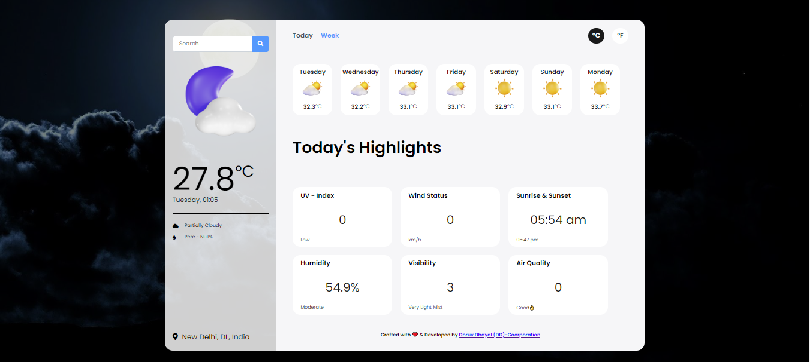
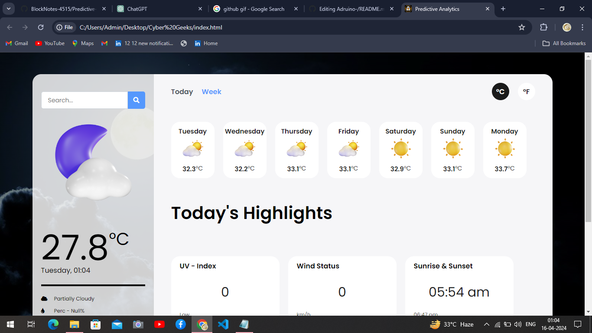
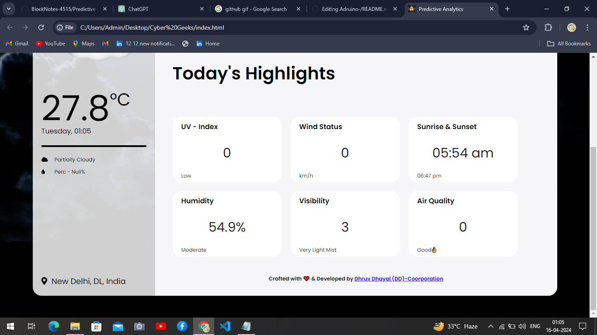
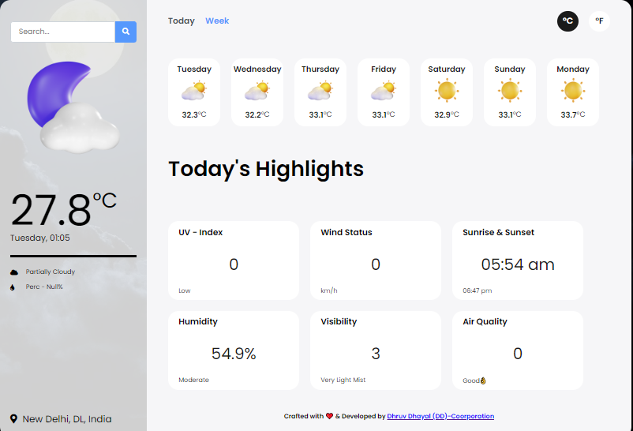
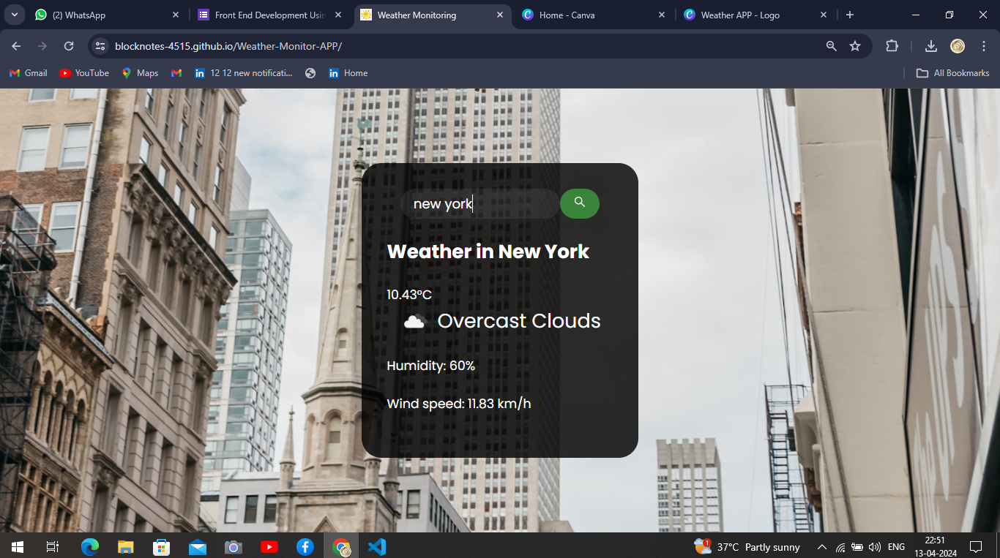
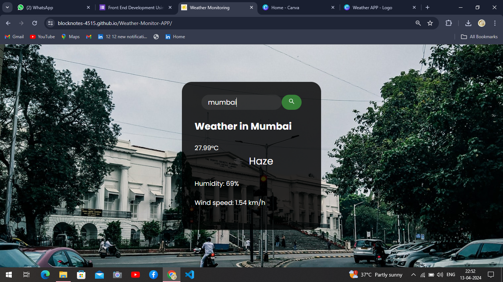
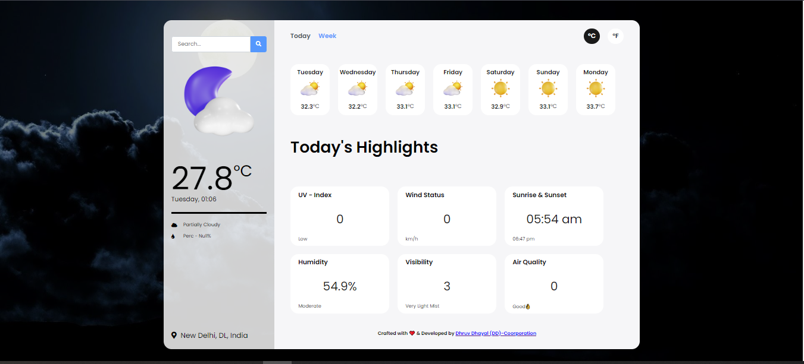

# AI-Project-Predictive-Analytics-
Predictive Analytics (Weather APP API) to Requirement, Testing, Training, Deployment, Predictions Output! 😎❤

<h1 align="center">WHITE ELEPHANT</h1>

  

## Overview / Main AIM / OBJ.😎🤑👍✔
Predictive Analytics is a web application designed to provide highly accurate weather forecasts for user-specified locations. Leveraging advanced predictive algorithms and machine learning techniques, it delivers detailed weather information including temperature, humidity, wind speed, and more.

## Features
- **Accurate Predictions:** Utilizes cutting-edge predictive algorithms to forecast weather conditions with high accuracy.
- **Detailed Weather Information:** Provides comprehensive weather data including temperature, humidity, wind speed, and more.
- **Location-Based Forecasting:** Enables users to search for weather forecasts for specific locations worldwide.
- **User-Friendly Interface:** Offers an intuitive and easy-to-use interface for seamless interaction.

## Technologies Used
- **Frontend:** HTML(5), CSS(3), JavaScript(JS) ||
- **Backend:** Python, Flask ||
- **Predictive Analytics:** Machine Learning algorithms (e.g., regression, neural networks) ||
- **APIs:** [Use WEATHER API (FOR - FREE)] ||

## Demonstration
<ul>
  <li>Live-Link: https://blocknotes-4515.github.io/Predictive-Analytics/</li>
  <li>Source Link: https://github.com/BlockNotes-4515/Weather-Monitor-APP</li>
  <li>Mobile APP: https://blocknotes-4515.github.io/Weather-Monitor-APP/</li>
  <li>Documentation: https://www.canva.com/design/DAGCpMlBmr4/YPJ9KeJwJQkIKHU2hrVMTQ/view?utm_content=DAGCpMlBmr4&utm_campaign=designshare&utm_medium=link&utm_source=editor</li>
</ul>

## Usage
<ul>
  <li> 1. You can also clone this repository for viewing the Source-code.</li>
  <li> 2. By, using GIT Commands you simply fork/Clone this repository.</li>
  <li> 3. Search any Location on the search bar!</li>
  <li> 4. View the Data Analyics like: (Weather, wind-speed, Humidity, Location, Place to search)</li>
  <li> 5. Live - Link: https://blocknotes-4515.github.io/Predictive-Analytics/</li>
  <li> 6. Documentation: https://www.canva.com/design/DAGCpMlBmr4/YPJ9KeJwJQkIKHU2hrVMTQ/view?utm_content=DAGCpMlBmr4&utm_campaign=designshare&utm_medium=link&utm_source=editor</li>
</ul>

## Contributing
Contributions to Predictive Analytics are welcome! Please refer to the [https://blocknotes-4515.github.io/Predictive-Analytics/) file for guidelines on how to contribute.
 
<h1 align="center">Team Members: (WHITE ELEPHANT) of AI Project!</h1>

  <table>
    <thead>
      <tr>
        <th>Name</th>
        <th>Year</th>
        <th>Project</th>
        <th>Role</th>
      </tr>
    </thead>
    <tbody>
      <tr>
        <td>Dhruv Dhayal</td>
        <td>2 - Year</td>
        <td>Web Development</td>
        <td>Leader (Prototype)</td>
      </tr>
      <tr>
        <td>Aditya Raj</td>
        <td>2 - Year</td>
        <td>PPT</td>
        <td>Controller</td>
      </tr>
      <tr>
        <td>Jaspreet Singh</td>
        <td>2 - Year</td>
        <td>Analytics Design</td>
        <td>Subordinates</td>
      </tr>
      <tr>
        <td>Jigyanshu Bhardwaj</td>
        <td>2 - Year</td>
        <td>Documentation</td>
        <td>Subordinates</td>
      </tr>
      <tr>
        <td>Ansh Takwal</td>
        <td>2 - Year</td>
        <td>Documentation</td>
        <td>Subordinates</td>
      </tr>
    </tbody>
  </table>

## Contributing
Contributions to Predictive Analytics are welcome! Please refer to the [https://blocknotes-4515.github.io/Predictive-Analytics/) file for guidelines on how to contribute.
 
<h1 align="center">Technology Used In a Project!</h1>

  <table>
    <thead>
      <tr>
        <th>S.NO: </th>
        <th>Language Used</th>
        <th>API Key</th>
        <th>Role</th>
      </tr>
    </thead>
    <tbody>
      <tr>
        <td>001</td>
        <td>HTML(5)</td>
        <td>WEATHER APIt</td>
        <td>Structuring</td>
      </tr>
      <tr>
        <td>002</td>
        <td>CSS(3)</td>
        <td>WEATHER API</td>
        <td>Styling</td>
      </tr>
      <tr>
        <td>003</td>
        <td>JavaScript(JS)</td>
        <td>Run WEATHER API</td>
        <td>Functioning</td>
      </tr>
      <tr>
        <td>004</td>
        <td>Bootstrap</td>
        <td>Icon & Responsive</td>
        <td>Framework</td>
      </tr>
     <tr>
       <td>005</td>
       <td>Jupyter / Google (Collab)</td>
       <td>Machine Learning</td>
       <td>Python (Liner Regression Model)</td>
     </tr> 
    </tbody>
  </table>

## Roadmap  ========>

  

### Planned Features
1. **Historical Weather Data:** Integrate functionality to display historical weather data for specified locations.
2. **Weather Alerts:** Implement a feature to provide real-time weather alerts for severe weather conditions.
3. **Customizable Dashboard:** Allow users to customize their weather dashboard with preferred metrics and locations.
4. **Multi-Language Support:** Add support for multiple languages to make the application accessible to a wider audience.
5. **Mobile Responsiveness:** Improve the responsiveness of the application for seamless use on mobile devices.
6. **Forecast Accuracy Improvement:** Continuously refine predictive algorithms to enhance forecast accuracy.

  

### Technical Improvements
1. **Performance Optimization:** Optimize backend processes and frontend rendering for improved performance.
2. **Code Refactoring:** Conduct code refactoring to enhance maintainability and readability.
3. **Security Enhancements:** Strengthen security measures to protect user data and prevent vulnerabilities.
4. **API Integration:** Explore additional weather data APIs for more comprehensive and accurate forecasts.
5. **Automated Testing:** Implement automated testing to ensure reliability and stability of the application.
6. **Documentation Enhancement:** Improve project documentation for better understanding and contribution.

  

### User Experience Enhancements
1. **Feedback Mechanism:** Introduce a feedback mechanism for users to provide suggestions and report issues.
2. **Interactive Map:** Incorporate an interactive map feature for visualizing weather patterns and forecasts.
3. **Personalized Recommendations:** Provide personalized weather recommendations based on user preferences and past searches.
4. **Social Media Integration:** Enable sharing weather forecasts and updates on social media platforms.
5. **Offline Access:** Develop functionality to allow users to access weather forecasts offline.
6. **Accessible Design:** Ensure accessibility standards are met for users with disabilities.

  

This roadmap outlines the planned features, technical improvements, and user experience enhancements for the Predictive Analytics project. Contributions and feedback are welcome as we work towards making the application more robust and user-friendly.

## Important Links
- [Live Demo](https://blocknotes-4515.github.io/Predictive-Analytics/)
- [PPT](https://www.canva.com/design/DAGCpMlBmr4/YPJ9KeJwJQkIKHU2hrVMTQ/view?utm_content=DAGCpMlBmr4&utm_campaign=designshare&utm_medium=link&utm_source=editor)
- [Documentation](https://docs.google.com/document/d/1u0vqq0khwNrlOBYrOc_hb2OA94XGlgNH/edit?usp=sharing&ouid=117969705994841390256&rtpof=true&sd=true)
- [Mobile Weathering APP](https://blocknotes-4515.github.io/Weather-Monitor-APP/)
- [Project Board](https://blocknotes-4515.github.io/Weather-Monitor-APP/)
- [Linkdin](https://www.linkedin.com/in/dhruv-dhayal-9568b7262/)
- [Github](https://github.com/BlockNotes-4515)

<h1 align="center">Image Gallery</h1>

    
    

  

 

    
    

  

 

    
    

  

 

    
    

  

## Support
For any inquiries or support, feel free to contact me at [your-dhayaldhruv271@gmail.com](mailto:dhayaldhruv271@gmail.com).

## License
This project is licensed under the [GNU General Public Lisence](LICENSE).

Special thanks to the WeatherApp API for providing the weather data used in this project.

 

    
    

